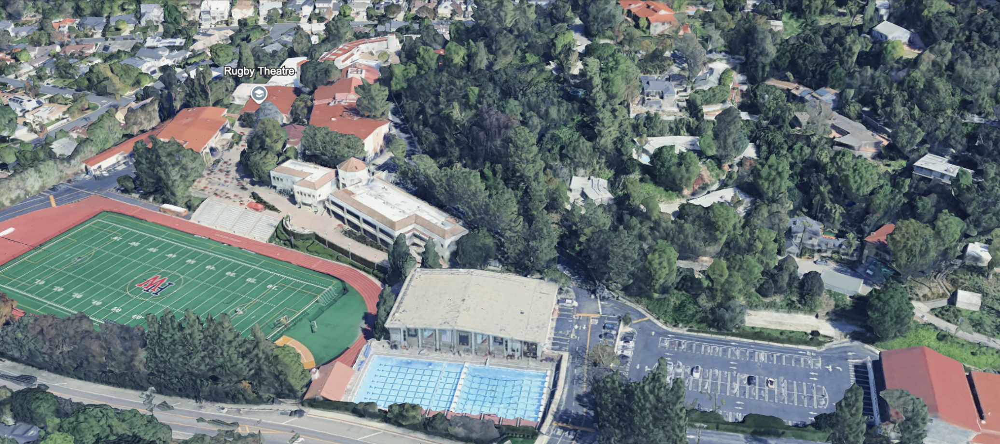
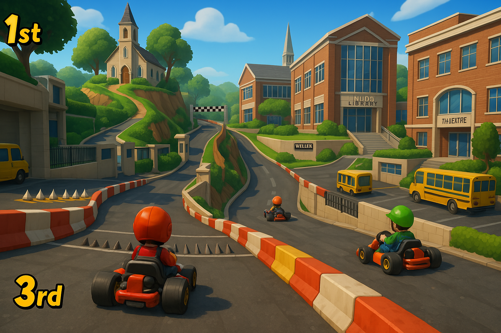
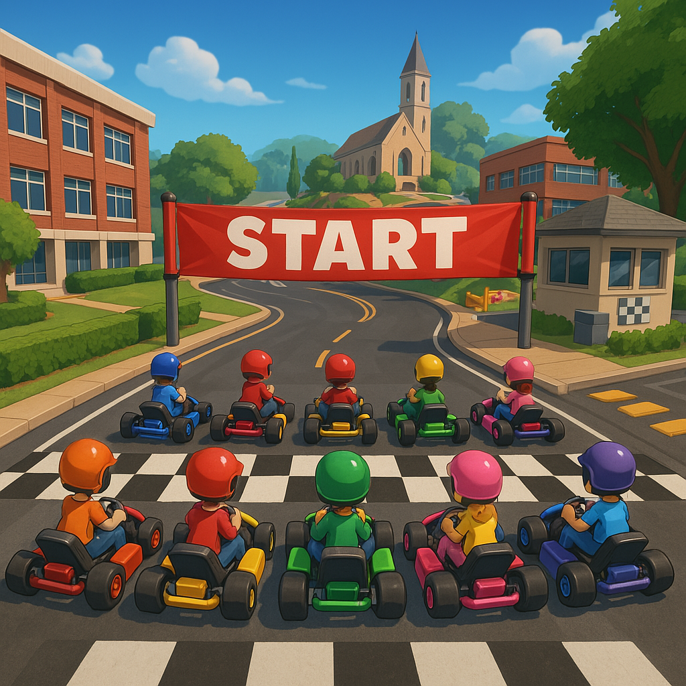

# HW KartKlash

## Game Concept

A multiplayer racing game set on the Harvard-Westlake campus. Players race go-karts around a track that follows the actual layout of the school grounds, featuring iconic locations and challenging terrain.

## Track Layout Example

The race track follows a circuit around the Harvard-Westlake campus:

- **Starting Line**: Begins on the straight path leading from the quad toward the security guard kiosk
- **First Section**: Leads into the parking lot with spikes and a challenging dip
- **Second Section**: Navigates through a narrow passage in the main parking lot
- **Third Section**: Curves back up toward the security kiosk
- **Fourth Section**: Right turn onto the steep fire road leading up to St. Saviour's Chapel
- **Fifth Section**: Behind the chapel is another steep descent into the teacher parking lot
- **Sixth Section**: Route continues toward Weiler Hall
- **Seventh Section**: Features a ramp from Weiler Hall up to Mudd Library
- **Eighth Section**: Path from library through the spire to Rugby Theatre
- **Final Section**: Through the quad back to the starting line

## Game Features
- All racing karts have identical performance specifications
- Players can choose from different Harvard-Westlake teachers as drivers
    - Each teacher character has 2 unique special abilities:
        - 1st: based on the subject they teach (general)
        - 2nd: based on their personality (specific)  
- Racers can collect various powerups throughout the track
- There are multiple maps you can go through instead of just one
    - ex. All-roof path, all-stairs path, cafeteria route, etc
- Feature for with/without "railings" where there are railings on the edges of the paths to make it easier for new players
- Hidden Shortcuts
- Moving Obsacles 
    - Lizards, students, etc 
- In-game currency in order to purhcase skins, upgrades, teachers, etc. 
- Weather, time of day, seasons 
    - Mr. Nealis
        - Cart: Ford F450 SUPER DUTY
        - Ability: Press 'k' to enter autopilot (cart will drive optimal path) and for 20 seconds jump in the truck bed and equip an automatic turret. Dealing enough damage to other racers will cause them to spin out for a duration.
    - Mr. Theiss
        - Cart: Tesla Cybertruck
        - Ability: "Crypto-flip" generates a hash on screen and gains a speed boost for a duration of the first number in seconds (hexidecimal)
    - Mr. Yaron
        - Ability: "Mossad Agent" Order an airstrike on an area of the map
        - Cart: Merkava M48 Heavy Tank
        - Passive: "Cockroach" Very slightly slower overall movement speed, but also very slightly lower durations for all debuffs 
    - Mr. Commons
        - Cart: FLoating Grad Cap
        - Ability: "Pursuit of Educational Excellence" Obstruct all other players' views with a student handbook
    - Earl (Security Guard)
        - Cart: HD Motorcycle
    - Mr. Varney
        - Ability: "TONY!!" Tony zooms through the track on a golf cart running over racers
        - Cart: Subaru Forester
        - Ability: "Dance Dance Revolution" All other racers are slightly slowed for a duration while a disco ball obstructs their view
    - Pyrough
        - Cart: Food truck (Vietnamese)
        - Ability: "No Charge" Disable all other powerups for a duration
    - Preciado
        - Cart: Running
        - Ability: "Sprint" Charges at people and if he hits someone they spin out, but post ability he gets tired and slows for a duration

### Powerups
- Trigonometry: Release sin curves that push other players back/slow them down
- Supply & Demand: Allows you to steal a powerup from another player, since you have higher demand
- Falling Grades: Create pools of "F"s on the floor bahind the player that will slow other players down because depression
- Additional powerup ideas can be added

🔴 Offensive Powerups
Name	Description
Pop Quiz	Temporarily blinds nearby racers with a flurry of quiz papers.
Red Reprimand Slip	Homing attack that targets the racer directly in front. Inspired by detention slips.
Lunch Rush	Drops spilled cafeteria trays behind you, causing others to slip.
Dean’s Call	Freezes a random player with a "please come to the Dean’s Office" notice.
Fire Drill	Triggers a loud bell — all players must pull over briefly unless they have “Permission to Leave Class” powerup.

🔵 Defensive Powerups
Name	Description
Permission Slip Shield	Absorbs the next incoming attack. Has a school crest animation.
Campus Map Warp	Teleports you forward to the next checkpoint, bypassing obstacles.
Library Silence Bubble	Surrounds your kart in a quiet zone — you can’t be targeted for 5 seconds.

🟢 Utility / Speed Boosts
Name	Description
H-W Spirit Boost	Short burst of speed. Kart leaves a trail of red-and-black streamers.
P.E. Sprint Mode	Your character runs Flintstone-style for 3 seconds, faster than karting.
Skateboard Shortcut	Temporary switch to a skateboard that can cut corners and fit through tight spaces.

🟣 Trick / Terrain Manipulation
Name	Description
Sprinkler Trap	Activates sprinklers on a section of the track, making it slippery.
Science Lab Spill	Leaves a glowing goo trail — racers who hit it spin out.
Chapel Echo	Sends a sonic boom from the chapel that disrupts control for racers within earshot.

- Each teacher character has unique special abilities, along with unique voice lines potentially sampled from the teachers themselves
- Racers can collect various powerups avaliable to all racers throughout the track
    - Classic Mario powerups but with a humorous twist toward harvard westlake
        - Excused absence: Teleport to the end of the section of the track that the player is currently on
        - Mandatory Meeting in Rugby: Choose another player to slow for a duration
        - All School Assembly: Slow all other players for a duration
- Racers can drift for a tiered speed boost based off of drift time

## Cafeteria Chaos Section:
Midway through the race, players burst through the double doors of the Harvard-Westlake cafeteria—only to instantly shrink to the size of a salt shaker. Inside this chaotic micro-course, the familiar lunchroom transforms into a maze of oversized obstacles: towering cartons of milk, sliding meatballs, bouncing apples, and puddles of spilled Gatorade that act like sticky traps. The real danger, however, is Pyrough—the cafeteria worker—who stomps through the kitchen with a giant ladle, trying to squash the tiny racers. Players must weave between food trays and silverware while avoiding Pyrough’s surprise attacks, adding a thrilling and surreal twist to the course.

## Campus Overview

<!-- Image 1: Aerial view of Harvard-Westlake campus showing Rugby Theatre, athletic fields, and swimming pool -->

<!-- Image 2: Aerial view showing St. Saviour's Chapel, Mudd Library, Rugby Theatre, and the main field -->

## Initial Image

