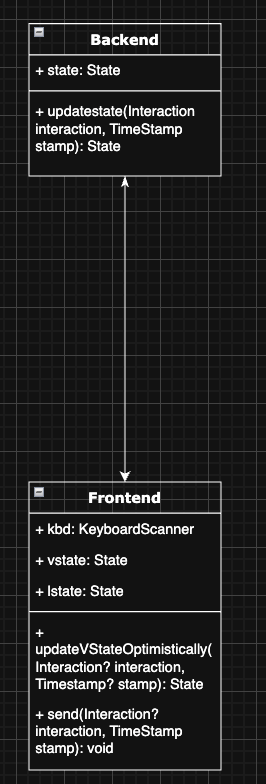
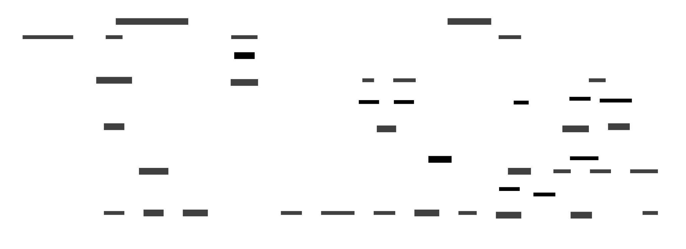

# Multiplayer Spec



The client should send keyboard inputs to the server (the line), which uses that information to update the state. The client should also update the state locally to ensure continuity for the user. The server should send full state updates back to the client when available. Below is a full multiplayer architecture example.



```d2
title: HW KartKlash – Full-Stack Architecture

PlayerDevice: "📱/💻 Player Device"
PlayerDevice.shape: rectangle

subgraph UnityClient: {
  label: "Unity Client (Netcode - ECS/DOTS)"
  InputSerializer: "Input Serializer\n(☑ sequence #, ☑ checksum)"
  LocalSim: "Local Physics &\nPrediction Loop"
  Reconciliation: "Rollback/Re-sim\n(& smooth corrections)"
  UI_Layer: "UI ↔ State Store"
  VoiceClient: "Proximity Voice\n(WebRTC)"
  DB_Cache: "Secure Preferences\n+ Asset Cache"
  LocalSim -> Reconciliation
  InputSerializer -> LocalSim
  UI_Layer <- LocalSim
  UI_Layer <- Reconciliation
  PlayerDevice -> InputSerializer
}

EdgePOP: "Edge Relay POP\n(Anycast UDP + DTLS)"
EdgePOP.shape: cylinder

PlayerDevice -> EdgePOP: "UDP/ENet + DTLS\n(~20 Hz inputs)"

subgraph AWS_VPC: {
  label: "AWS VPC (us-west-2)"

  // realtime layer
  RealtimeRelay: "Realtime Relay\n(Stateless, ×N)"
  RealtimeRelay.shape: cylinder

  // game simulation shards
  GameSimCluster: "Authoritative Sim\n(StatefulSet, ×N)"
  GameSimCluster.shape: rectangle

  // micro-services
  MatchService: "Matchmaking svc"
  LobbyService: "Lobby / Room svc"
  AuthService: "Auth & Social"
  EconomyService: "Economy / Store"
  StatsService: "Stats & Leaderboards"
  VoiceSIG: "Voice SIG Server\n(Colyseus/Vivox)"
  AdminAPI: "Ops / Observability\n(OpenTelemetry)"

  // shared infra
  Redis: "Redis Cluster\n(ephemeral frames)"
  Postgres: "PostgreSQL RDS\n(persistent data)"
  S3: "S3 + CloudFront\n(Asset Bundles, DLC)"
  Redis.shape: cylinder
  Postgres.shape: cylinder
  S3.shape: cylinder

  // data-flow
  EdgePOP -> RealtimeRelay: "Z-ordered inputs"
  RealtimeRelay <-> GameSimCluster: "gRPC frames\n(delta-compressed)"
  GameSimCluster -> Redis: "authoritative tick"
  GameSimCluster -> Postgres: "results / telemetry"
  MatchService <-> LobbyService
  MatchService -> GameSimCluster: "alloc session"
  LobbyService -> RealtimeRelay: "WS control plane"
  PlayerDevice <-> VoiceSIG: "WebRTC signalling (HTTPS)"
  VoiceSIG <-> GameSimCluster: "pos updates (event bus)"
  PlayerDevice -> S3: "asset-bundle GET"
  AuthService -> Postgres
  EconomyService <-> Postgres
  StatsService <-> Postgres
}
```