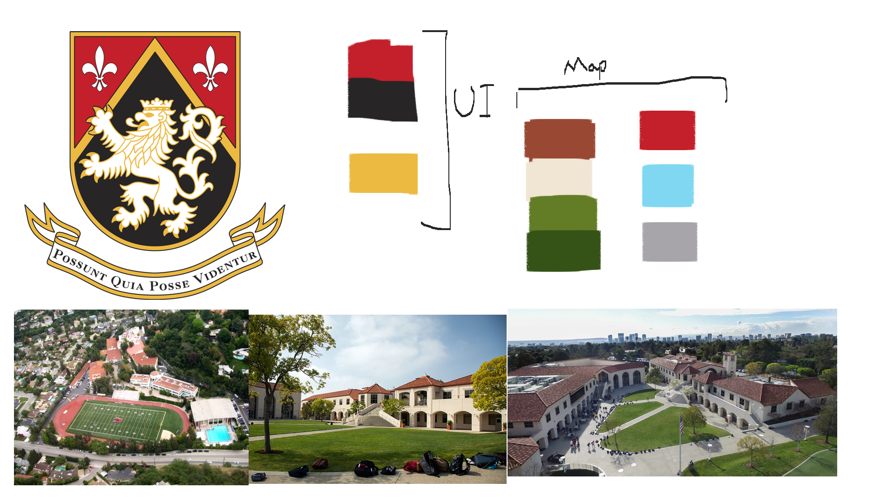
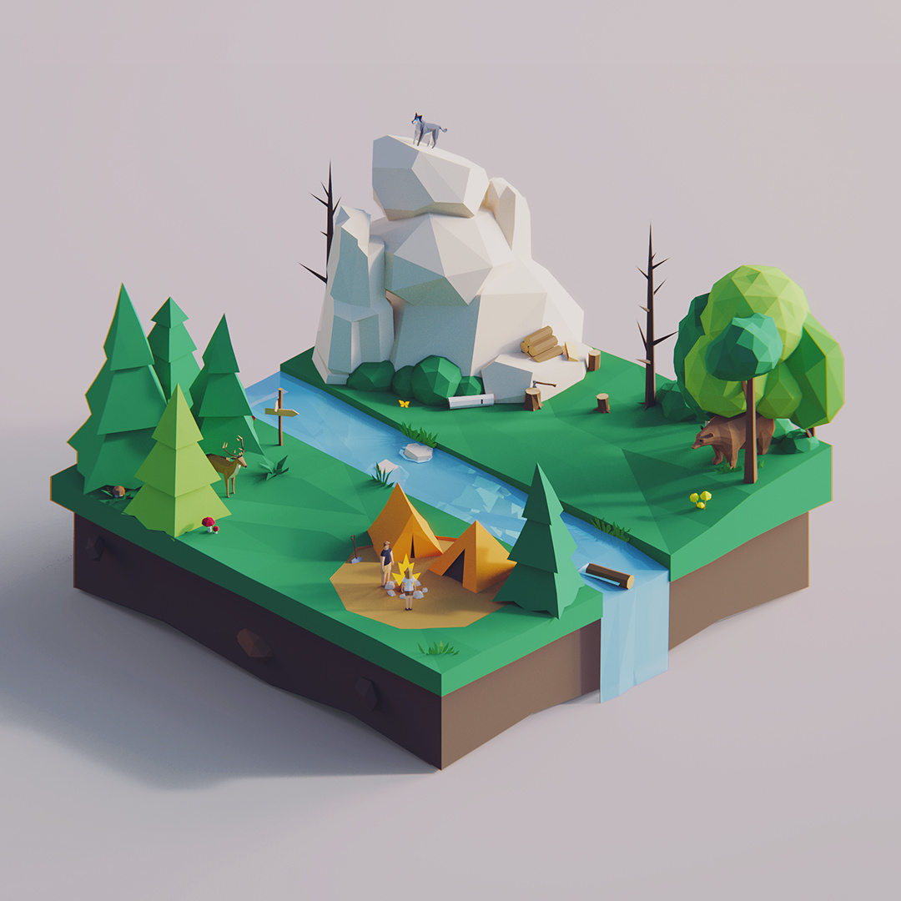
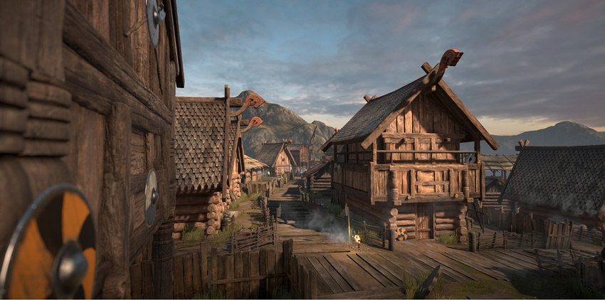

# 🏁 HW Kart Klash – Art Direction Guide

This document outlines art directions for HW Kart Klash, a kart racing game themed around Harvard-Westlake. It includes tone ideas, visual hierarchy, art styles, and shading choices.

---

## 🎭 Mood & Tone

**Cheerful & Happy**  
   - Inspired by party kart games  
   - Bright, saturated colors  
   - Fun and engaging

---

## 🧩 Visual Hierarchy

**Round & Soft Forms**  
   - Emphasizes playfulness and friendliness  
   - Works well with exaggerated or cute designs

---

## 🎨 Color Palette
*(Will vary depending on chosen style)*  

---

## 🖌️ Art Styles

**Stylized / Cartoonish**  
   - Similar to Mario Kart  
   - Requires more polish, consistent style

### Secondary option, if the first one isn't integratable in time:

**Low Poly**
   - Simple geometry, flat colors  
   - Minimal shading; highly stylized

---

## 💡 Shading Styles

**Standard Shader (PBR)**  
- **Usage**: Realistic lighting and surface materials  
- **Pros**: Built-in to Unity, no code needed  
- **Cons**: Heavier performance usage  
- **Typical Use**: Semi-realistic kart games 

