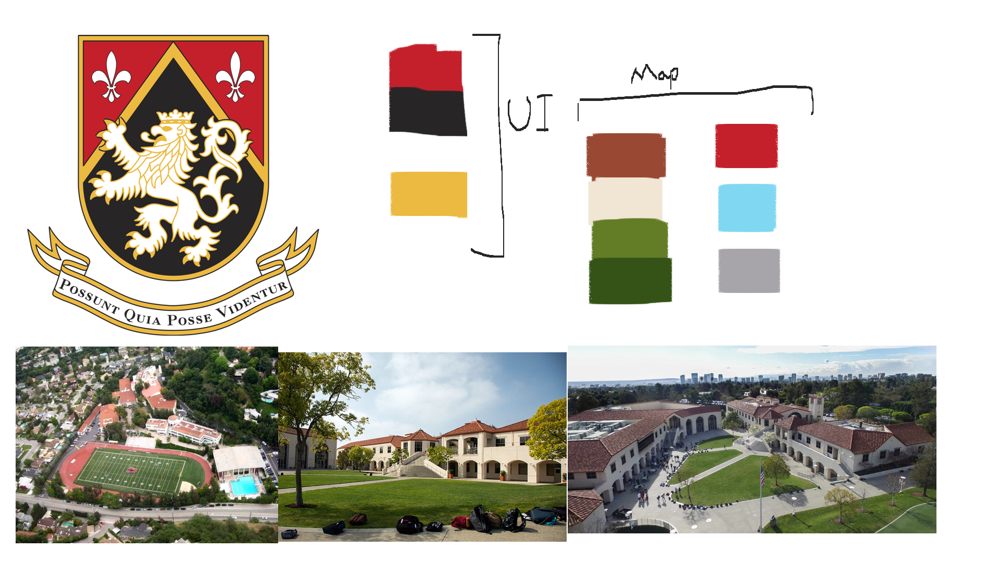
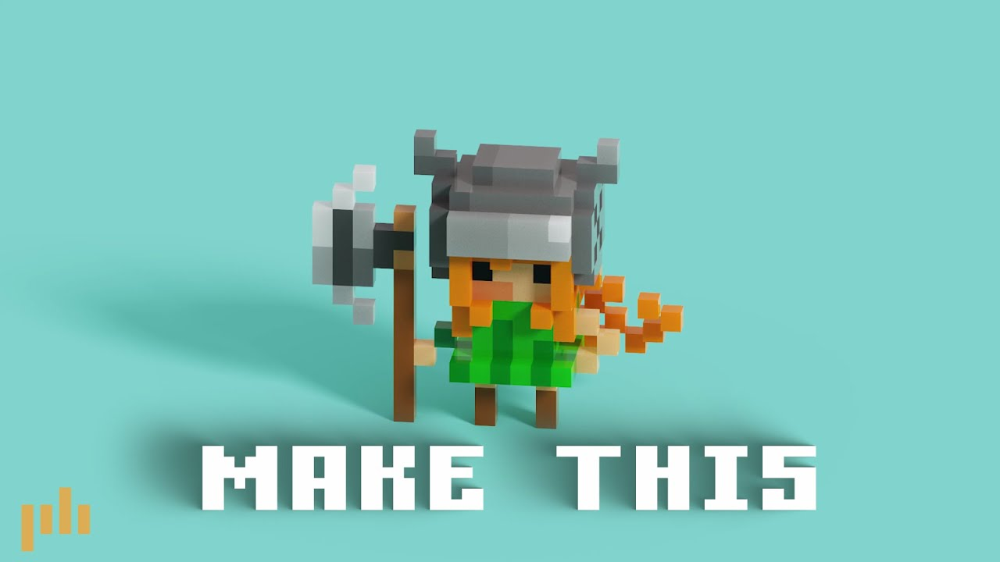
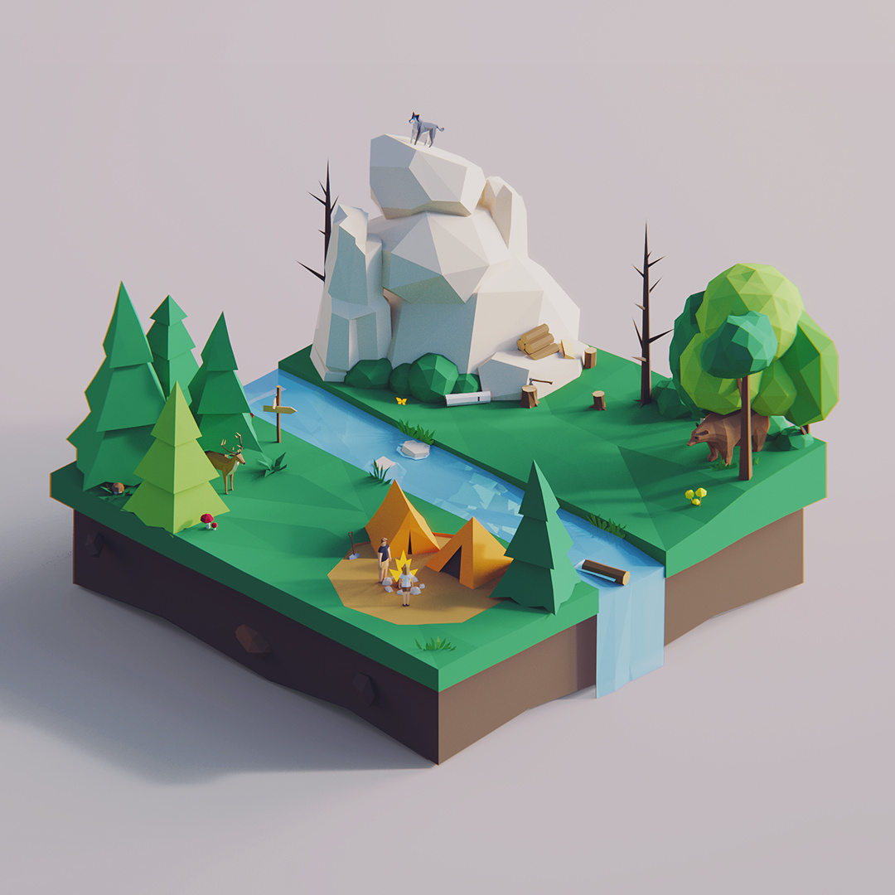
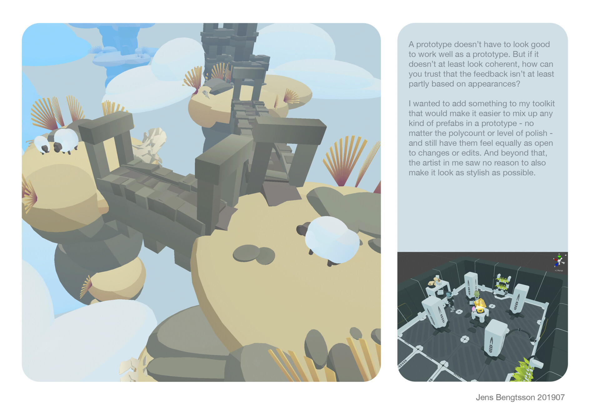
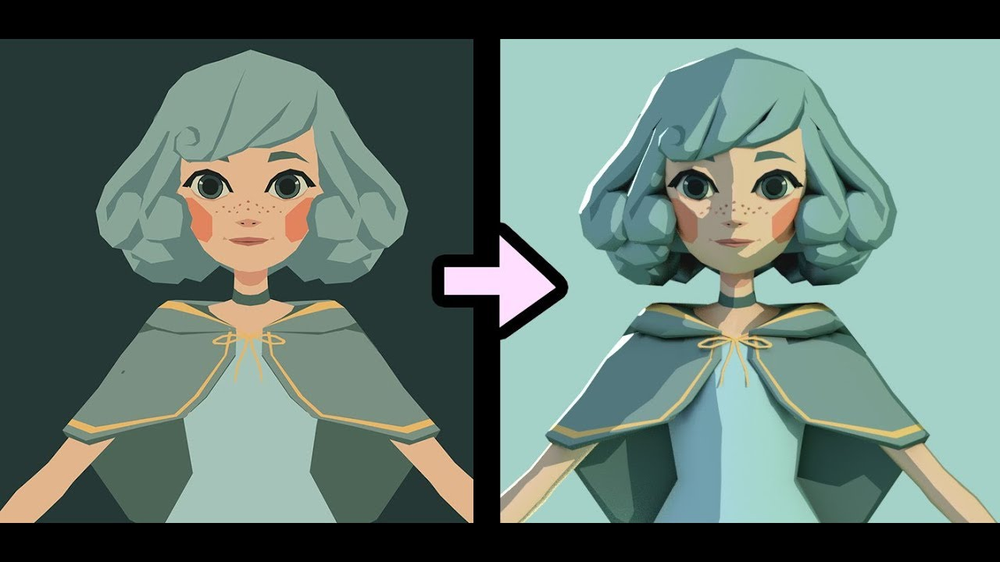

# 🏁 Kart Game – Art Direction Guide

This document outlines possible art directions for a kart racing game themed around Harvard-Westlake. It includes tone ideas, visual hierarchy, art styles, and shading options with difficulty rankings and pros/cons to help guide asset creation.

---

## 🎭 Mood & Tone

1. **Cheerful & Happy**  
   - Inspired by party kart games  
   - Bright, saturated colors  
   - Fun and engaging

2. **Depressed / Gritty**  
   - It's Harvard Westlake, what do you expect? 
   - Reflects a more cynical or ironic tone (e.g., school stress)  
   - Low saturation, duller colors  
   - Emotionally heavier atmosphere

---

## 🧩 Visual Hierarchy

- **Sharp & Square-Based Design**  
  - Emphasizes a modern, structured feel  
  - Common in institutional/architectural settings

- **Round & Soft Forms**  
  - Emphasizes playfulness and friendliness  
  - Works well with exaggerated or cute designs

---

## 🎨 Color Palette
*(Will vary depending on chosen style)*  

---

## 🖌️ Art Styles (Ranked by Difficulty)

1. **Voxel** – *Very Easy*  
   - Blocky, pixel-art-like aesthetic 
   - Great for fast prototyping or retro feel  
   - eg. Crossy road
    

2. **Low Poly** – *Easy to Moderate*  
   - Simple geometry, flat colors  
   - Minimal shading; highly stylized
   

3. **Stylized / Cartoonish** – *Moderate to Hard*  
   - Similar to Mario Kart  
   - Requires more polish, consistent style  

---

## 💡 Shading Styles (Ranked by Difficulty)

### 1. **Unlit Shader** – *Easiest*  
- **Usage**: Flat color, no lighting interaction  
- **Pros**: Very fast; great for retro or minimal styles  
- **Cons**: No dynamic lighting or shadows  
- **Typical Use**: UI overlays, minimaps  
- 🔗 [Unlit Shader Demo](https://www.polygon-treehouse.com/blog/2017/10/2/lighting-the-unlit)  

---

### 2. **Standard Shader (PBR)** – *Moderate*  
- **Usage**: Realistic lighting and surface materials  
- **Pros**: Built-in to Unity, no code needed  
- **Cons**: Heavier performance usage  
- **Typical Use**: Semi-realistic kart games  

---

### 3. **Toon Shading** – *Hard*  
- **Usage**: Comic-style with outlines and flat shading  
- **Pros**: Visually appealing, ideal for fun/kid-friendly games  
- **Cons**: Requires custom shaders or post-processing  
- **Typical Use**: Mario Kart, anime-styled visuals  
