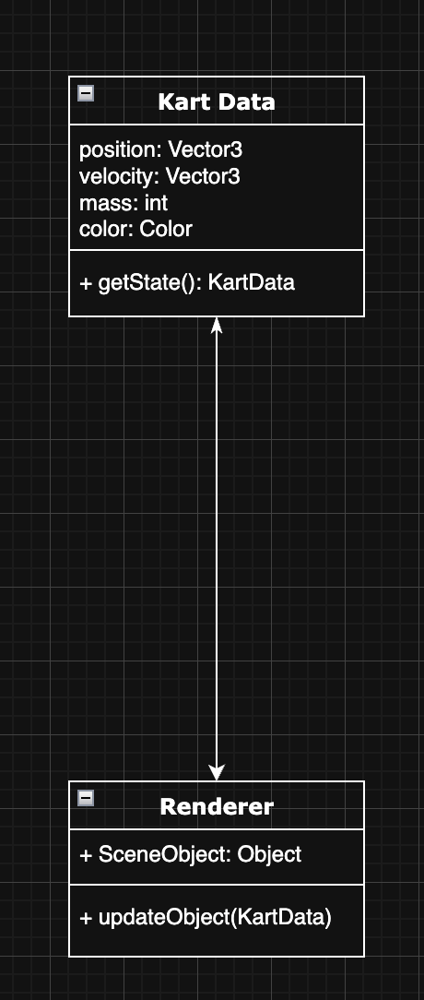

# Kart Rendering

1. Kart Data class

Member	Kind	Purpose
position : Vector3	instance variable (field)	World-space coordinates of the kart’s centre of mass. A three-component vector (x, y, z) lets the physics and renderer know where the kart is.
velocity : Vector3	field	Linear velocity of the kart in m s⁻¹, again in world space. This tells both the physics integrator and any motion-blur or wheel-spin effects how fast / in what direction the kart is travelling.
mass : int	field	Mass in kilograms (or whatever unit your engine uses). Physics forces (impulses, collisions, etc.) scale by this value.
color : Color	field	A material or simple RGB/hex value that lets the renderer tint the kart’s mesh or sprite.
getState() : KartData	public method	Returns a snapshot (often an immutable struct or a deep copy) of the kart’s current state. External systems—AI, networking, the renderer—can call this without mutating internal state.

⸻

2. Renderer class

Member	Kind	Purpose
SceneObject : Object	field	Handle or reference to the engine-level object (mesh, entity, sprite, etc.) that visually represents this kart in the scene graph. Think of it as the render-time twin of the physics object.
updateObject(kart : KartData)	public method	Pulls data out of the passed-in KartData instance and pushes it to the graphics layer:• sets SceneObject.position = kart.position• applies colour/material changes (kart.color)• might feed velocity into motion-blur shaders, exhaust particle emitters, etc.

⸻

3. Connection between the classes
	•	Type: Unidirectional association / dependency (solid line with an arrowhead pointing from Renderer to Kart Data).
	•	Meaning: The renderer depends on the data model, but the data model knows nothing about the renderer.
	•	In practice, a game loop might look like:
	1.	Physics system mutates a KartData instance each tick.
	2.	Renderer.updateObject(kartData) is called, using the arrow-indicated dependency to read but not modify the model.
	•	Why not inheritance? The arrowhead is open and sits on a plain line, not a triangle on a solid line, so this is not generalisation/extends; it’s simply “Renderer needs KartData in order to do its job.”

⸻

Big picture:
	•	Kart Data is your authoritative source-of-truth for physics and gameplay state.
	•	Renderer is a consumer of that state, translating numbers into on-screen visuals every frame.
	•	The one-way arrow preserves separation of concerns: changes in rendering tech won’t ripple back into the physics model, keeping the architecture clean and modular.